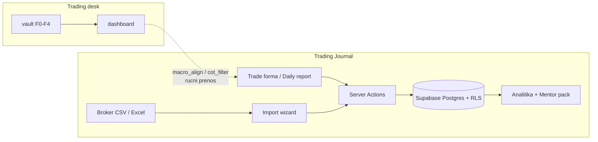

# ICT Trading Journal

Next.js aplikacija za **vođenje ICT trade dnevnika i merenje sopstvene statistike**: unos izvršenja,
proces-dnevnik po danu, uvoz broker izvoda, i analitika koja odgovara na pitanje *šta u mom procesu
zapravo zarađuje*. Jedan korisnik po dizajnu, multi-tenant siguran po konstrukciji — svaka tabela je
zaštićena Postgres Row Level Security politikom.

Ovo je **treći repo trading desk-a**. Makro bias, COT filter i nedeljni plan (F0–F4) žive u
[`trading-fundamental-vault`](https://github.com/0xsickre/trading-fundamental-vault) i prikazuju se na
[`trading-dashboard`](https://github.com/0xsickre/trading-dashboard). Ovaj repo je **izvršni sloj**:
šta je stvarno odtrgovano, po kojoj ceni, sa kakvom disciplinom i sa kojim ishodom.

Deploy: Vercel · Baza: Supabase Postgres (odvojen projekat od dashboard-a)

---

## Sadržaj

- [Pregled](#pregled)
- [Ključni koncepti](#ključni-koncepti)
- [Arhitektura](#arhitektura)
- [Preduslovi](#preduslovi)
- [Instalacija](#instalacija)
- [Funkcionalnosti](#funkcionalnosti)
- [Model podataka](#model-podataka)
- [Metrike](#metrike)
- [Testovi](#testovi)
- [Deploy](#deploy)
- [Bezbednosni model](#bezbednosni-model)
- [Struktura projekta](#struktura-projekta)
- [Konvencije](#konvencije)
- [Dokumentacija](#dokumentacija)

---

## Pregled

Journal je **izvor istine za izvršenje**. Vault odgovara na pitanje *koji smer i da li je ulaz
kvalitetan*; journal odgovara na pitanje *šta sam od toga stvarno uradio i koliko me je to koštalo*.

Dizajniran je oko jedne teze: **P&L je posledica, proces je uzrok.** Zato dnevna ocena (A–F) meri
napredak na aktivnom procesnom cilju — nikad zaradu — a analitika razlaže rezultat po dimenzijama
koje su pod tvojom kontrolom (setup grade, entry model, disciplina, poštovanje makro bias-a) umesto
po tome da li je dan bio zelen.

### Šta journal isporučuje

- **Kompletan zapis pozicije** — plan (entry / stop / target / rizik), izvršenje kroz više fill-ova,
  i review sa MAE/MFE, sve u jednom parent zapisu.
- **Merenje kvaliteta izvršenja** — entry slippage (planirani ulaz vs stvarni prosečni fill) i
  target attainment % (koliko planiranog reward-a si stvarno uzeo), odvojeno od P&L-a.
- **Procesni dnevnik po danu** — jutro / tokom dana / veče, Douglas mantre, kontrola impulsa,
  micromanage praćenje, ocena dana vezana za aktivni fokus cilj.
- **Prop-firm disciplinu** — FTMO challenge pravila po nalogu sa zamrzavanjem naloga na proboj.
- **Analitiku koja se može pripisati** — win rate, profit factor i expectancy razloženi po
  `macro_align`, `cot_filter`, setup grade, entry model, technical tags, psihologiji i grešci.
- **Mentor pack** — Markdown izvoz sa **pre-izračunatim** statistikama za LLM review.
- **Vezu ka vault-u** — polja `macro_align`, `cot_filter` i `htf_bias` vezuju svaki trejd nazad na
  nedeljni makro kontekst iz vault sistema.

### Šta journal ne radi (granica scope-a)

Journal **ne generiše bias i ne radi analizu**. Nema makro modula, nema COT čitača, nema signala.
`macro_align` i `cot_filter` su *zapis odluke* koju je doneo vault, ne njena rekonstrukcija.

Journal takođe **nije risk engine brokera**: FTMO evaluacija računa se iz **realizovanog (zatvorenog)
neto P/L-a**, dok pravi prop firm meri intraday *equity* uključujući plutajući P/L. To trenira
disciplinu na demo nalogu, ali ne zamenjuje brokerov obračun.

TA plan za F5 (entry trigger, timeframe, izvršenje) ide u Notion — van ovog repoa.

---

## Ključni koncepti

### Tri repoa, tri uloge

| Repo | Odgovara na | Smer podataka |
|------|-------------|---------------|
| [`trading-fundamental-vault`](https://github.com/0xsickre/trading-fundamental-vault) | Koji smer? Je li ulaz kvalitetan? | Write (agent, F1–F4) |
| [`trading-dashboard`](https://github.com/0xsickre/trading-dashboard) | Gde je ciklus stao? Šta je spremno? | Read-only prikaz |
| **`Trading_Journal`** (ovaj repo) | Šta sam odtrgovao i sa kakvom disciplinom? | Write (ti, posle F5) |

Repoi **nisu integrisani kodom** — nema deljene baze ni API poziva između journal-a i vault-a. Veza je
semantička: watchlist instrumenata je usklađen sa vault `instrument_registry`, a per-trade polja
`macro_align` / `cot_filter` beleže vault odluku u trenutku ulaska.

### Pozicija i fill-ovi

Trejd nije jedan red. Model je **parent pozicija + child izvršenja**:

- `tj_positions` — plan, ICT setup, psihologija, lifecycle. Jedan red = jedna ideja.
- `tj_executions` — pojedinačni fill-ovi (entry ili exit, cena, količina, fee, swap).
- `tj_position_stats` — SQL view koji iz fill-ova računa `avg_entry`, `avg_exit`, `gross_pl`,
  `net_pl`, `realized_r`, `realized_r_net`.

Zbog toga **scale-out radi tačno**: pozicija sa tri parcijalna izlaza daje jedan težinski R-multiple,
a ne tri odvojena „trejda" koji kvare statistiku.

Ista matematika postoji **dva puta** — u SQL view-u (`tj_position_stats`) i u TypeScript-u
(`src/lib/journal/position-stats.ts`) — i to je namerno: view služi za brzo listanje, TS za live
preračun u formi dok kucaš. Paritet čuva Vitest suite.

### Trade lifecycle

| Status | Značenje |
|--------|----------|
| `planned` | Setup sa entry/stop/target, **bez broker fill-a**. Plan ≠ otvorena pozicija. |
| `open` | Postoji entry fill. |
| `partial` | Exit količina < entry količina — scale-out u toku. |
| `closed` | Potpuno izašao. |
| `missed` | Plan koji se nikad nije otvorio (`miss_reason` + `missed_at`). |

**Zašto `missed` postoji:** propušteni setup je podatak. Ako ti A-grade setup-ovi sistematski beže,
to je problem izvršenja koji nijedna P&L statistika neće pokazati.

### Proces pre P&L

- **Fokus cilj** (`tj_focus_goals`) — jedan aktivan procesni cilj koji traje nedeljama.
- **Ocena dana** (A–F) — meri **isključivo** napredak na tom cilju. Zelen dan sa prekršenim pravilom
  je loša ocena.
- **Kompletan vs Nacrt** — dan je kompletan tek kad postoje aktivan cilj, ocena dana i odgovor na
  pitanje o prekršenom pravilu.

### Watchlist — B6 FTMO

Usklađen sa vault `instrument_registry`, seed-uje se na registraciju
(`tj_seed_instruments_defaults`):

| Grupa | Simboli |
|-------|---------|
| **Trade (8)** | `EURUSD`, `GBPUSD`, `USDJPY`, `USDCAD`, `AUDUSD`, `SP500`, `NAS100`, `XAUUSD` |
| **Radar (2)** | `HG`, `RTY` |

CSV import normalizuje broker aliase (`US500.cash` → `SP500`, `US100.cash` → `NAS100`,
`GOLD` → `XAUUSD`, `Copper` → `HG`).

---

## Arhitektura



| Sloj | Tehnologija | Uloga |
|------|-------------|-------|
| Rute | Next.js 16 App Router, route group `(app)` | Auth-checked layout, sve stranice server-rendered |
| Mutacije | **Server Actions** | Nema REST API ruta — svaki upis ide kroz server action |
| Čitanja | Supabase server client u Server Components | Direktan SELECT pod korisnikovim RLS-om |
| Sesija | `src/proxy.ts` (Next.js 16 proxy) | Refresh Supabase auth, redirect neulogovanih na `/login` |
| Baza | Supabase Postgres | RLS na svakoj `tj_*` tabeli |
| Grafikoni | TradingView `/x/` snapshot URL-ovi | Bez file hosting-a i bez Supabase Storage |

**Izuzetak od „sve kroz Server Actions":** komponenta `TradeImages` piše direktno u `tj_trade_images`
preko browser Supabase klijenta (i dalje pod RLS-om), jer je to čist URL upis bez server logike.

### Rute

| Ruta | Sadržaj |
|------|---------|
| `/` | Dashboard — 16 stat kartica, equity curve, R-distribucija, heatmap, breakdown tabela, FTMO baneri |
| `/journal` | Sortabilan/filtrabilan grid trejdova + CSV i Excel izvoz |
| `/daily` | **Dnevni izveštaj** — procesni dnevnik + fokus cilj |
| `/trades/new` | Unos trejda (~23 polja pozicije) |
| `/trades/[id]/edit` | Izmena postojećeg trejda |
| `/import` | CSV/Excel import sa mapiranjem kolona i rekonsilijacijom |
| `/settings` | CRUD nad dropdown listama, instrumentima i nalozima |
| `/login` | Prijava / registracija (Supabase Auth) |

### Jezik interfejsa

Aplikacija je **mešano engleski / srpski** — namerno, jer je procesni deo lični, a analitički deo
standardna trading terminologija:

| Deo | Jezik |
|-----|-------|
| Dnevni izveštaj (`/daily`) | **Srpski** — nav labela **Dnevni izveštaj**, sve labele, toast-ovi, Douglas mantre, Tharp tipovi tržišta |
| FTMO baner + Settings → Accounts FTMO blok | **Srpski** (npr. *Zamrznut*, *Reset izazov*) |
| Mentor pack izvoz | **Srpski** — AI instrukcije u Markdown fajlu |
| Trade forma | **Mešano** — labele uglavnom engleske; srpski placeholder-i, lifecycle akcije (*Vrati u planned*), FTMO toast-ovi |
| Dashboard, Journal, Import, Settings (ostalo) | **Engleski** (dashboard export preview prikazuje **Izvoz:**) |

Datumi u dnevnom izveštaju koriste `date-fns` locale `sr` (npr. `sre, 22. jul 2026.`).

---

## Preduslovi

| Zahtev | Verzija | Napomena |
|--------|---------|----------|
| **Node.js** | 20+ | Next.js 16 traži ≥ 20.9; desk repoi inače voze Node 22 |
| **Next.js** | 16 (App Router) | React 19, TypeScript, Tailwind CSS v4 |
| **Supabase projekat** | free tier dovoljan | **Odvojen** od dashboard projekta — `tj_*` tabele |
| **Broker izvoz** | CSV ili Excel | Opciono; ručni unos radi bez toga |

Ključne zavisnosti: `@supabase/ssr` + `@supabase/supabase-js` (auth i data), `@tanstack/react-table`
(journal grid), `recharts` (grafikoni), `react-hook-form` + `zod` (forme i validacija),
`papaparse` + `xlsx` (import/izvoz), `date-fns` + `date-fns-tz` (timezone po nalogu).

---

## Instalacija

```bash
git clone https://github.com/0xsickre/Trading_Journal.git
cd Trading_Journal
npm install
```

### Env

`.env.local` u root-u projekta:

```env
NEXT_PUBLIC_SUPABASE_URL=https://<your-project-ref>.supabase.co
NEXT_PUBLIC_SUPABASE_ANON_KEY=<your-anon-public-key>
```

Obe vrednosti su u **Supabase Dashboard → Project Settings → API**. `service_role` ključ se
**nikad** ne koristi u ovoj aplikaciji.

```bash
npm run dev      # http://localhost:3000
npm run build    # produkcioni build
npm run lint     # ESLint (eslint-config-next)
npm run test     # Vitest
```

### Baza

Migracije se primenjuju kroz Supabase CLI (`supabase db push`) ili SQL editor. Repo sadrži
`supabase/migrations/` — **samo inkrementalne delte** (od `20260719120000` nadalje); svež Supabase
projekat traži punu baseline šemu plus sve fajlove redom.

| Migracija | Šta radi |
|-----------|----------|
| `20260719120000` | Brisanje legacy analysis modula |
| `20260719143000` | B6 universe — 10 instrumenata |
| `20260719150000` | Uklanjanje `session_killzone` liste (kasnije migracije je vraćaju; i dalje van trade forme) |
| `20260720120000` | `technical_tags` + `trade_journal_notes`; brisanje starih tag kolona |
| `20260720130000` | MAE/MFE cenovne kolone |
| `20260720140000` | Brisanje `vix_regime`, `news_nearby` |
| `20260720150000` | TradingView snapshot slike; brisanje `chart_url` |
| `20260720160000` | RLS initplan fix, indeksi, TV URL CHECK, RPC hardening |
| `20260720170000` | `tj_position_stats` view |
| `20260721120000` | `macro_align`, `cot_filter`; trim dropdown lista |
| `20260721130000` | Lifecycle `missed` + `miss_reason` lista |
| `20260721140000` | `security_invoker` na view-u |
| `20260721150000` | FTMO kolone na nalogu |
| `20260722120000` | `tj_daily_reports` + `tj_focus_goals` |
| `20260722130000` | `no_trade_day` na dnevnim izveštajima |

> Ako je iz starije verzije ostao **`trade-images`** Storage bucket, možeš ga ručno obrisati u
> **Supabase → Storage** — slike su sada isključivo TradingView `/x/` URL string-ovi.

### Prvi korisnik

Kreiraj korisnika u **Supabase → Authentication → Users** ili kroz **Sign in / Create account**
tabove na `/login`. Za ličnu upotrebu isključi email potvrdu pod
**Authentication → Providers → Email**.

Novi nalozi se seed-uju automatski auth trigger-om (`tj_on_auth_user_created`); dodatno se
`tj_seed_my_defaults` poziva idempotentno pri prvom učitavanju dashboard-a
(`src/lib/journal/ensure-defaults.ts`).

---

## Funkcionalnosti

### Dnevni izveštaj — procesni dnevnik

Nav: **Dnevni izveštaj** (`/daily`). Ceo modul je na **srpskom**.

- **Kalendarski dan = timezone primarnog naloga** — jedan red po `(user_id, report_date)`, gde se
  `report_date` izvodi iz `getPrimaryAccount().timezone`. (Nema per-account dnevnih izveštaja u v1.)
- **Trajni fokus cilj** — jedan aktivan cilj koji traje nedeljama; ocena dana (A–F) meri napredak
  **samo** na njemu, nikad P&L (Trillium pristup). Cilj se postavlja, menja ili **diplomira** iz
  kartice fokus cilja.
- **Navigacija po datumima** — prev/next kontrole; budući datumi su ograničeni na *danas* u timezone-u
  primarnog naloga. Prečica **Danas** kad gledaš prošli dan.
- **Ocena dana** — A–F; badge prikazuje **Kompletan** vs **Nacrt** po pravilima kompletnosti.
- **Dan bez trejdova** (`no_trade_day`) — checkbox za dane bez ulaza. Kad je čekiran: sakriva
  **Tokom dana** i **Kontrola impulsa** kartice, plus Douglas mantru / prihvatanje rizika u jutarnjoj
  sekciji; briše micromanage, impulse flagove i `risk_accepted`. Večernji debrief ostaje. **Ne**
  zaobilazi obavezu ocene dana ni odgovora o prekršenom pravilu.
- **Jutro · pre trejda** — mentalna temperatura (1–10), kvalitet sna (1–5), makro beleška, Tharp tip
  tržišta (Bik/Medved/Bočno × Mirno/Volatilno), potvrde Douglas mantri, prihvatanje rizika, mentalna
  proba. **Low-mental alert** kad je temperatura < 5.
- **Tokom dana** — mid-day provera za intraweek swing (London, NY, ili između sesija — ne tek na
  večernjem debrief-u). **Untouched-first micromanage tok**: checkbox *Nisam dirao otvorene pozicije
  danas* postavlja `micromanage = untouched` (bez pomeranja stopa, parcijala, averaging-a ili
  neplaniranih zatvaranja). Ako nije čekiran, slede dugmad **Pratio sam** / **Prekršio sam**
  (`watched` / `violated`).
- **Kontrola impulsa** — Douglas-ova četiri straha (FOMO, strah od gubitka, strah da grešiš, pohlepa)
  plus opciona beleška o impulsu.
- **Veče · debrief** — prekršeno pravilo?, šta sam naučio, šta menjam sutra i kako, najlakši layup
  setup, pregled dana, proslavi procesnu pobedu.
- **Petak pravilo** — checkbox za vikend izloženost petkom (`friday_flat`).
- **Ručno čuvanje** — izolovano od trejdova i naloga u v1; server action `saveDailyReport` radi upsert
  na `(user_id, report_date)`.

### Unos trejda

- **Streamlined forma** — **23 polja pozicije** (`form-config.ts`), raspoređena kroz *Plan & Setup* i
  *Execution & Review*: `ict_entry_model`, `setup_grade`, jedinstveni `technical_tags` i jedno
  `trade_journal_notes` polje umesto preklapajućih tag/dropdown/text kolona.
- **Progresivni Risk Plan** — polja se otkrivaju korak po korak: entry → stop → target + risk % →
  position size → planned R:R. Smanjuje greške pri unosu.
- **Direction se ne bira** — izvodi se iz entry vs stop (`stop < entry` → Long, `stop > entry` →
  Short) čim su obe cene unete, i menja se uživo.
- **Position-size kalkulator** — automatski iz `risk % × balans naloga ÷ (stop distanca × point value)`.
- **Planned R:R** — automatski iz entry / stop / target (svestan smera); čuva se kao reward multiple
  (npr. `2.45`), ne kao dropdown.
- **Parcijalni izlazi** — jedna parent pozicija sa više fill-ova; težinski R-multiple preko svih izlaza.
- **Gross vs Net P/L** — čisto kretanje cene odvojeno od rezultata posle fee-jeva i swap-a.
- **TradingView snapshot embed-ovi** — tri slota po trejdu (**HTF Pre**, **LTF Pre**, **LTF Post**) u
  `tj_trade_images` kao `tradingview.com/x/…` URL-ovi. Nula troška hostinga; PNG se renderuje iz
  snapshot ID-a. Legacy `chart_url` je uklonjen — galerija je jedini izvor istine.
- **MAE / MFE** — `max_drawdown_price` i `max_profit_price` pri review-u; live MAE/MFE u R i MFE
  capture % u metrics bar-u forme.
- **Makro veza** — `macro_align` (Uz bias / Protiv bias / Van scope), `cot_filter` (Ulaz dozvoljen /
  Odložen / Ne chase) i `htf_bias` vezuju izvršenje za vault kontekst.
- **Form prefs** — poslednji korišćeni `accountId` i `riskPct` se pamte u `localStorage`
  (`tj:trade_form_prefs`).

### Merenje kvaliteta izvršenja

Dve metrike koje odvajaju *kvalitet plana* od *kvaliteta izvršenja*:

- **Entry slippage** — razlika između **Planned Entry Price** (`entry_price`) i prosečnog ulaza iz
  fill-ova, izražena u R prema planiranoj stop distanci (nepovoljan fill = negativan R). Traži
  planirani ulaz i bar jedan entry fill; stop je potreban za R. Dashboard prikazuje prosek, ukupan
  slip R i nedeljni grafikon.
- **Target attainment %** — `realized_r / planiran target R`. Koliko si planiranog reward-a stvarno
  uzeo (plan 3R, uzeo 1.2R → 40%). Dashboard: prosek + samo dobitnici + nedeljni grafikon.

Razlikuj od **MFE Capture %** (`realized_r / MFE R`) — to meri koliko si zadržao od maksimalne
povoljne ekskurzije, i prikazuje se u trade formi.

### FTMO / prop-firm mod

- **Per-account toggle** — uključuje se na bilo kom nalogu u **Settings → Accounts**; podrazumevano
  isključen i aditivan, pa postojeći nalozi ostaju netaknuti. FTMO labele su na srpskom.
- **Konfigurabilna pravila** — max dnevni gubitak %, max ukupni gubitak / statički drawdown %, profit
  target % i minimalan broj dana trgovanja, svako zasebno uključivo (default 5% / 10% / 10% / 4 dana).
- **Živa evaluacija** — računa se iz **realizovanog (zatvorenog) neto P/L-a** po timezone-u naloga;
  dashboard prikazuje **FTMO baner** po nalogu sa statusom (`active` / `passed` / `failed` — UI:
  Aktivan / Položen / Zamrznut), profit %, drawdown % i najranijim probojem po prekršenom pravilu.
- **Zamrzavanje naloga** — na statusu `failed` **novi trejdovi su blokirani** na tom nalogu
  (`createTrade` vraća grešku na srpskom) dok ne uradiš **Reset izazov** u Settings.
- **Reset izazova** — `resetFtmoChallenge` postavlja `ftmo_reset_at`, pa se trejdovi pre reset-a
  ignorišu; isti nalog može ponovo da vozi challenge.

### Journal grid

- TanStack Table sa sortiranjem, pretragom i filterima po koloni (instrument, smer, grade, model,
  rezultat, status) plus poseban **Missed** toggle.
- Kolone: broj trejda, datum (timezone naloga), instrument, smer, grade, size, entry, slip R, exit, R,
  target attainment %, gross P/L, net P/L, status, TradingView snapshot link.
- Jedan klik za CSV i Excel izvoz trenutno filtriranog prikaza.
- **Activate** akcija (`activateTrade`) za uvezene redove bez fill-ova (`needs_review: true`).

### Analitika

- **16 stat kartica** — Trades, Win rate, Net P/L, Gross P/L, Total R, Avg R, Profit factor,
  Expectancy, Best, Worst, Win/Loss streak, Max drawdown, Avg entry slip, Total slip R, Target
  attainment (sve + samo dobitnici). Portfolio statistike koriste **isključivo zatvorene** pozicije.
- **Equity curve** — Gross ↔ Net toggle, `$` ili R metrika, kumulativno od početnog balansa naloga.
- **R-distribucija** — histogram sa bojenim barovima od `<−3R` do `>5R`.
- **Kalendar heatmap** — 26 nedelja dnevnog P/L-a u timezone-u naloga.
- **Nedeljni grafikoni** — entry slippage (R) i target attainment (%) po nedelji.
- **Breakdown tabela** — win rate, total R, avg R i net P/L grupisani po: macro align, COT filter,
  setup grade, technical tags, entry model, direction, instrument, psychology tags ili mistake.
- Filteri po nalogu i vremenskom rasponu kroz ceo dashboard.

### Mentor pack

- Dugme **„Export for Claude"** na dashboard-u preuzima samostalan Markdown fajl za izabrani period
  (Day / Week / Month / Quarter / Year / **Custom** / All).
- Statistike (win rate, profit factor, expectancy, slippage, target attainment, breakdown-i) su
  **pre-izračunate u fajlu**, tako da LLM tumači brojke umesto da ih preračunava (ili halucinira).
  Nema API integracije.
- Izvoz sadrži **srpske instrukcije za AI mentora** (*Uputstvo za tebe (AI mentor)*) — odgovaraj na
  srpskom, ne preračunavaj statistiku. Breakdown-i uključuju **HTF bias** (koji dashboard tabela ne
  nudi kao group-by opciju).
- Do **300 zatvorenih trejdova** razvijeno u punom detalju po izvozu; otvoreni / needs-review i
  propušteni setup-i se navode odvojeno.

### Dropdown liste — potpuno editabilne

- **17 dropdown/tag lista** seed-uje se po korisniku. Trade forma vezuje **15** kao select ili tags;
  **`direction`** se automatski računa iz entry vs stop (nije dropdown), a **`session_killzone`** je
  seed-ovan samo za Settings i istoriju.
- Organizovane po kategorijama: **Context** (direction, macro align, COT filter, session/killzone,
  HTF bias, entry TF), **ICT Setup** (technical tags, entry model, setup grade), **Risk** (risk %,
  result, exit reason, miss reason), **Psychology** (emotion, discipline, rules followed, mistake).
- **+ Add** inline na svakom dropdown-u; **Settings → Lists** za pun CRUD, redosled i boju.
- **Soft-delete** — arhiviranje opcije je sklanja iz formi, ali istorijski trejdovi ostaju netaknuti
  i filtrabilni.

### Import i rekonsilijacija

- Upload CSV ili Excel broker izvoza.
- Mapiranje kolona sa **keyword auto-detekcijom** i ručnim override-om po koloni.
- Rekonsilijacija po redu: **Create / Merge / Skip**.
  - Merge menja **samo objektivna izvršna polja** (cena, količina, fee, swap) — psihologija, ICT model
    i beleške se nikad ne prepisuju.
  - Pun diff highlight izmenjenih vrednosti.
- Normalizacija instrument aliasa (`US500.cash` → `SP500`, `GOLD` → `XAUUSD`, `Copper` → `HG`).
- Redovi bez fill-ova dobijaju `needs_review`; aktiviraju se iz journal grid-a.
- Sirovi redovi se čuvaju za audit trag (`tj_import_batches` + `tj_import_rows`).

> Tabela `tj_column_mappings` postoji u šemi za buduće čuvanje broker preset-a — **još nije vezana u UI**.

### Instrumenti i nalozi

- Per-instrument `point_value` za P/L matematiku kroz klase aktiva (editabilno u Settings). P/L je u
  **quote valuti instrumenta** — ne konvertuje se u valutu naloga.
- Više naloga, svaki sa svojom valutom, početnim balansom, **IANA timezone**-om i opcionom FTMO
  konfiguracijom. Svi timestamp-ovi se prikazuju u lokalnom vremenu naloga, bez obzira na mašinu.
- **Primarni nalog** određuje kalendarski dan u Dnevnom izveštaju.

---

## Model podataka

```
tj_accounts          – broker nalozi (valuta, balans, IANA timezone, FTMO challenge config)
tj_instruments       – simboli sa point_value po klasi aktive (B6 watchlist, 10 simbola)
tj_option_lists      – 17 dropdown/tag lista (Context, ICT Setup, Risk, Psychology;
                       session_killzone seed-ovan ali van trade forme)
tj_option_items      – opcije lista (soft-delete)

tj_positions         – parent zapis trejda: technical_tags[], psychology_tags[], trade_journal_notes,
                       ICT setup (ict_entry_model, setup_grade, htf_bias, entry_tf), risk plan
                       (entry_price, stop_price, target_price, planned_rr), makro veza
                       (macro_align, cot_filter), MAE/MFE (max_drawdown_price, max_profit_price),
                       lifecycle (status, miss_reason, missed_at)
tj_executions        – child fill-ovi (entry ili exit, cena, količina, fee, swap, timestamp UTC)
tj_position_stats    – SQL view (security_invoker): avg_entry, avg_exit, entry_qty, gross_pl,
                       net_pl, realized_r, realized_r_net

tj_trade_images      – TradingView /x/ snapshot URL-ovi po trejdu (htf_pre, ltf_pre, ltf_post)
tj_focus_goals       – jedan aktivan procesni cilj po korisniku (goal_text, started_at, ended_at,
                       is_active)
tj_daily_reports     – jedan red po kalendarskom danu: ocena dana, jutarnji/večernji debrief,
                       mid-day micromanage (untouched / watched / violated), Douglas impulse flagovi,
                       friday_flat, no_trade_day
tj_import_batches    – metapodaci import sesije
tj_import_rows       – audit po redu (raw + parsed + match status)
tj_column_mappings   – broker preset-i za mapiranje kolona (samo šema — UI nije implementiran)
```

**Invarijante**

- Svi timestamp-ovi se čuvaju kao `timestamptz` (UTC). Prikaz i parsiranje pri importu konvertuju u
  IANA timezone naloga preko `date-fns-tz`.
- Dropdown vrednosti se čuvaju kao **plain text**, pa arhiviranje opcije nikad ne kvari istorijske
  podatke.
- `tj_position_stats` radi sa `security_invoker = on`, pa direktan REST upit na view poštuje RLS
  korisnika koji pita, a ne vlasnika view-a.

---

## Metrike

| Metrika | Formula | Napomena |
|---------|---------|----------|
| **Gross P/L** | `(exitNotional − avgEntry × exitQty) × dir × point_value` | Kretanje cene pre troškova |
| **Net P/L** | `gross_pl − fees − swap` | Posle troškova |
| **Realized R (gross)** | `gross_points / (\|planned_entry − stop\| × entry_qty)` | Imenilac koristi **planirani** `entry_price` (fallback: prosečan fill) |
| **Realized R (net)** | `net_pl / planned_risk_$` | Kolona `realized_r_net` u `tj_position_stats` |
| **Target attainment %** | `realized_r / planned_target_R × 100` | Koliko planiranog reward-a si uzeo |
| **MFE Capture %** | `realized_r / mfe_R × 100` | Koliko si zadržao od maksimalne povoljne ekskurzije |
| **Entry slippage** | nepovoljni pts / \|planirani entry − stop\|, u R | Odvojeno od P/L-a — ne duplira se |
| **Profit factor** | `sum(wins) / sum(\|losses\|)` | Samo zatvoreni trejdovi |
| **Expectancy** | `winRate × avgWinR + lossRate × avgLossR` | Prosečan win/loss R samo iz trejdova sa validnim R |
| **FTMO drawdown %** | `(starting_balance − min_equity) / starting_balance × 100` | Najgori realizovani pad equity-ja od starta, zatvoreni trejdovi u tz naloga |

Portfolio statistike (win rate, PF, expectancy) uključuju **samo zatvorene** pozicije. Parcijali su
isključeni osim ako eksplicitno uključiš `toRealized({ includePartial: true })`.

---

## Testovi

```bash
npm run test         # Vitest, jedan prolaz
npm run test:watch   # watch mode
```

Suite pokriva **čistu poslovnu logiku** u **11 Vitest fajlova** pod `src/lib/journal/`:

| Fajl | Šta pokriva |
|------|-------------|
| `analytics.test.ts` | Dashboard statistike, equity curve, breakdown-i, nedeljne serije |
| `position-stats.test.ts` | P/L i R matematika — paritet sa SQL view-om |
| `plan-calculations.test.ts` | Position size, planned R:R, izvođenje smera |
| `entry-slippage.test.ts` | Planirani ulaz vs fill (pts + R) |
| `exit-efficiency.test.ts` | Target attainment |
| `ftmo.test.ts` | Evaluacija prop-firm pravila |
| `trade-lifecycle.test.ts` | planned / open / partial / closed / missed |
| `instrument-aliases.test.ts` | Normalizacija broker simbola |
| `tradingview-snapshot.test.ts` | Parsiranje i validacija `/x/` URL-ova |
| `daily-report.test.ts` | Datumski i completion helper-i dnevnog izveštaja |
| `default-instruments.test.ts` | B6 watchlist |

Nema CI workflow-a u ovom repou — kvalitetni gate je lokalan:

```bash
npm run lint && npm run test && npm run build
```

---

## Deploy

Vercel.

1. Push na GitHub, pa import repoa na [vercel.com/new](https://vercel.com/new).
2. U **Vercel → Settings → Environment Variables** dodaj za `Production` **i** `Preview`:
   ```
   NEXT_PUBLIC_SUPABASE_URL      = https://<ref>.supabase.co
   NEXT_PUBLIC_SUPABASE_ANON_KEY = <anon key>
   ```
3. U **Supabase → Authentication → URL Configuration** postavi:
   - **Site URL**: `https://<tvoj-vercel-domen>.vercel.app`
   - **Redirect URLs**: `https://<tvoj-vercel-domen>.vercel.app/**`
4. Redeploy.

> **Preporuka:** posle kreiranja naloga isključi javnu registraciju —
> **Supabase → Authentication → Providers → Email → odčekiraj „Allow new users to sign up"**.
> Time sprečavaš tuđe registracije, a tvoj nalog radi normalno.

---

## Bezbednosni model

Aplikacija je jednokorisnička, ali je izolacija **strukturna, ne konvencijska** — da tuđa registracija
(ili greška u upitu) ne može da dohvati tvoje podatke.

- **Row Level Security na svakoj `tj_*` tabeli** — `user_id = (select auth.uid())` (initplan-safe),
  uključujući `tj_focus_goals` i `tj_daily_reports`.
- **`tj_position_stats`** radi sa `security_invoker = on`, pa view poštuje RLS onoga ko pita umesto da
  ga zaobiđe.
- **Bez Supabase Storage** za grafikone — samo TradingView `/x/` URL string-ovi u `tj_trade_images`.
- **`service_role` ključ se nikad ne referencira u frontend kodu** — izložen je isključivo `anon`
  publishable ključ.
- **Interne seed funkcije** (`tj_seed_defaults`, `tj_seed_instruments_defaults`, `rls_auto_enable`) su
  revoked za `anon`; `tj_seed_my_defaults` ostaje kao fallback za ulogovanog korisnika.
- **`tj_trade_images.image_url`** ima DB CHECK constraint — dozvoljen je samo `tradingview.com/x/…`.
- **Autentikacija** je u potpunosti na Supabase Auth (bcrypt, JWT, opciono MFA).

---

## Struktura projekta

```
src/
├── app/
│   ├── (app)/                 Zaštićene rute (auth-checked layout)
│   │   ├── page.tsx           Dashboard
│   │   ├── journal/           Journal grid
│   │   ├── daily/             Dnevni izveštaj + fokus cilj (+ actions.ts)
│   │   ├── trades/            Novi / izmena trejda (+ actions.ts)
│   │   │   ├── new/page.tsx
│   │   │   └── [id]/edit/page.tsx
│   │   ├── import/            CSV/Excel import wizard (+ actions.ts)
│   │   ├── settings/          Liste, instrumenti, nalozi (+ actions.ts)
│   │   └── loading.tsx        Skeleton na nivou rute
│   ├── login/                 Auth stranica (sign-in / sign-up) + actions
│   └── globals.css            Tailwind v4 tema (dark po defaultu)
├── components/
│   ├── app/                   App shell (sidebar + mobilni topbar)
│   ├── journal/               Feature komponente (trade forma, grid, dashboard,
│   │                            dnevni izveštaj, fokus cilj, heatmap, import wizard,
│   │                            FTMO baner, settings, …)
│   └── ui/                    shadcn/ui primitivi
├── lib/
│   ├── supabase/              client / server / middleware / user helper-i + generisani TS tipovi
│   └── journal/               Poslovna logika
│       ├── analytics.ts       Dashboard statistike, equity curve, breakdown-i, nedeljne serije
│       ├── position-stats.ts  Deljena P/L + R matematika (paritet sa SQL view-om)
│       ├── plan-calculations.ts   Position size, planned R:R, smer
│       ├── entry-slippage.ts  Slippage planirani ulaz vs fill (pts + R)
│       ├── exit-efficiency.ts Target attainment (realized R / planirani reward R)
│       ├── ftmo.ts / ftmo-status.ts   Evaluacija prop-firm challenge-a
│       ├── mentor-export.ts   Builder Markdown „mentor pack"-a
│       ├── trade-lifecycle.ts planned / open / partial / closed / missed
│       ├── tradingview-snapshot.ts   Parsiranje i validacija /x/ URL-ova
│       ├── instrument-aliases.ts / default-instruments.ts   B6 watchlist + broker aliasi
│       ├── daily-report.ts / daily-report-queries.ts   Tipovi procesnog dnevnika + upiti
│       ├── focus-goal.ts / focus-goal-queries.ts   Aktivan cilj + brojanje dana
│       ├── trades.ts          Upiti nad trejdovima/pozicijama
│       ├── form-config.ts     Deklarativna trade forma (23 polja pozicije)
│       ├── trade-form-prefs.ts    localStorage default-i forme (nalog, risk %)
│       ├── types.ts           Deljeni tipovi bezbedni za klijent
│       ├── options.ts / accounts.ts / instruments.ts / time.ts / format.ts / nav.ts
│       └── ensure-defaults.ts Idempotentni fallback za seed po korisniku
└── proxy.ts                   Next.js 16 session proxy (zamenjuje middleware.ts)

supabase/migrations/           Inkrementalne delte (od 20260719120000)
```

---

## Konvencije

**Nema REST API ruta.** Svaka mutacija ide kroz Server Action (`login/`, `daily/`, `trades/`,
`import/`, `settings/actions.ts`). Čitanja idu Supabase server klijentom u Server Components. Jedini
izuzetak je `TradeImages`, koji piše TradingView URL direktno preko browser klijenta pod RLS-om.

**Vreme je uvek per-account.** Čuvanje u `timestamptz` (UTC), prikaz u IANA timezone-u naloga.
Kalendarski dan u Dnevnom izveštaju izvodi se iz **primarnog** naloga.

**Dropdown vrednosti su tekst, ne foreign key.** Zato soft-delete opcije ne kvari istoriju.

**Statistika se ne duplira.** P/L i R matematika postoje u SQL view-u i u TypeScript-u, ali su
paritetne i pokrivene testom — nova metrika ide na oba mesta ili ni na jedno.

**Watchlist prati vault.** Novi instrument se prvo dodaje u vault `instrument_registry`, pa ovde u
`default-instruments.ts` (+ alias u `instrument-aliases.ts` ako ga broker drugačije zove).

**Migracije su aditivne i vremenski označene.** Format `YYYYMMDDHHMMSS_opis.sql`, nikad izmena
postojećeg fajla — nova delta.

---

## Dokumentacija

| Izvor | Za šta |
|-------|--------|
| **Ovaj README** | Pregled proizvoda, arhitektura, setup, metrike |
| [`AGENTS.md`](AGENTS.md) / [`CLAUDE.md`](CLAUDE.md) | AI ulaz (Cursor / Claude Code) |
| [trading-fundamental-vault](https://github.com/0xsickre/trading-fundamental-vault/blob/master/README.md) | F0–F5 ciklus, makro bias, COT filter |
| [vault `workflow.md`](https://github.com/0xsickre/trading-fundamental-vault/blob/master/workflow.md) | Sedmični runbook (13 koraka) |
| [trading-dashboard](https://github.com/0xsickre/trading-dashboard/blob/master/README.md) | Read-only prikaz nedeljne analize |

---

## Napomena

Privatni repo — lična upotreba. Supabase projekat journal-a je **odvojen** od dashboard projekta; ne
pokreći dashboard migracije ovde ni obrnuto. Sadržaj je lični trading zapis, ne investicioni savet.
